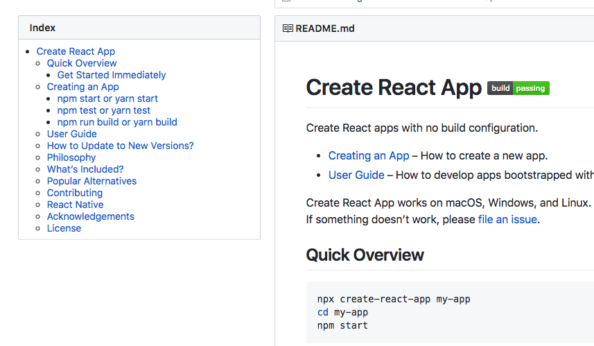

# Github Readme Index

A chrome plugin to show index for github markdown pages (like readme).



## Install

1. Clone this repo
```
git clone https://github.com/matsumatsu233/github-readme-index.git
```

2. Build
```
npm install
npm run build
```

3. Load this unpacked extension on Chrome